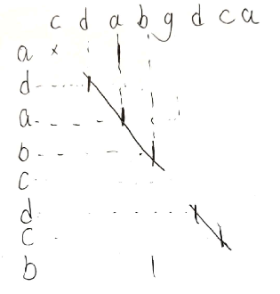

### 最长公共子串（Longest Common Substring）

最长公共子串（Longest Common Substring）： 是指两个字符串中最长连续相同的子串长度。

例如：str1=“1AB2345CD”,str2=”12345EF”,则str1，str2的最长公共子串为2345。

### 解题
这个题目, 我们一拿到手,就可以想到暴力解决办法
for循环遍历str1, for循环遍历str2,
对每个子串进行比较,找相同字母, 直到不同,长度与最长的比较,记录下最长与起始,终点位置.

然而对字符串进进行比较,又需要循环, 所以这个算法的时间复杂度为O(n3)

### 优化-动态规划

那么我们有什么好办法呢. 将两个字符串写在表格中.我们会得到如下的场景



我们会发现, 最长连续的字串一定是一条斜线. 只是哪个斜线最长,就是最长公共子串.

那么我们便可以想到状态转移方程.<br>
dp[i][j]=dp[i-1][j-1]+1      ,A[i]==B[j]<br>
dp[i][j]=0                   ,A[i]!=B[j]


对于这种状态转移方程,写出递归写法是很简单的了. 我们此处写非递归的,使用空间换时间 此时时间复杂度O(n2)空间复杂度O(n2)

``` java
public static final int LongestCommonSubString(String str1, String str2) {
    if (str1 == null || str2 == null) {
        return 0;
    }

    int[][] dp = new int[str1.length()+1][str2.length()+1];
    int maxLength = 0;
    for (int i = 1; i <= str1.length(); i++) {
        for (int j = 1; j <= str2.length(); j++) {
            if (str1.charAt(i - 1 ) == str2.charAt(j - 1)) {
                dp[i][j] = dp[i -1][j -1] +1;
            } else {
                dp[i][j] = 0;
            }

            if (dp[i][j] > maxLength) {
                maxLength = dp[i][j];
            }
        }
    }
    return maxLength;
}
```

很显然,我们使用了一个叫dp的表, 当然, 动态规划问题的解决时候很多都依赖一个表,来记录递归时候重服的计算. 而这个问题,我们发现. 当前的dp[i][j] 只依赖上一行的dp[i -1][j -1] 其他就没有了.

### 优化-缩表
我们的表,其实只要刚刚的表只要2*j长度就够了.就能满足 这样的操作.这样能省下来大量的空间, 试想下, i达到了1000,j达到了1000.
那么我们省下了1000*1000 - 2000的空间, 这对于算法来说, 是很大的空间节约了.

这样空间复杂度是O(N)

``` java
public static final int LongestCommonSubString2(String str1, String str2) {
    if (str1 == null || str2 == null) {
        return 0;
    }

    int[] dp1 = new int[str2.length()+1];
    int[] dp2 = new int[str2.length()+1];
    int maxLength = 0;
    for (int i = 1; i <= str1.length(); i++) {
        for (int j = 1; j <= str2.length(); j++) {
            if (str1.charAt(i - 1 ) == str2.charAt(j - 1)) {
                dp2[j] = dp1[j -1] +1;
            } else {
                dp2[j] = 0;
            }

            if (dp2[j]  > maxLength) {
                maxLength = dp2[j] ;
            }
        }

        for (int k = 0; k < dp1.length; k++) {
            dp1[k] = dp2[k];
        }

    }
    return maxLength;
}

```
